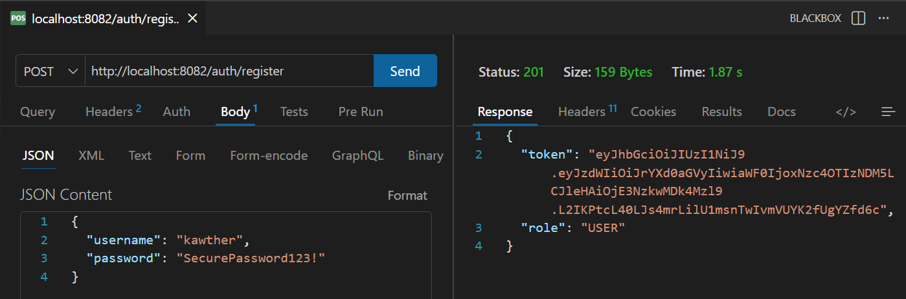
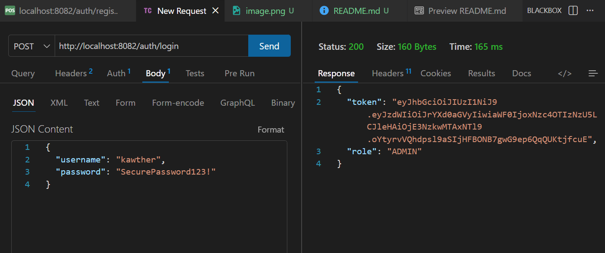
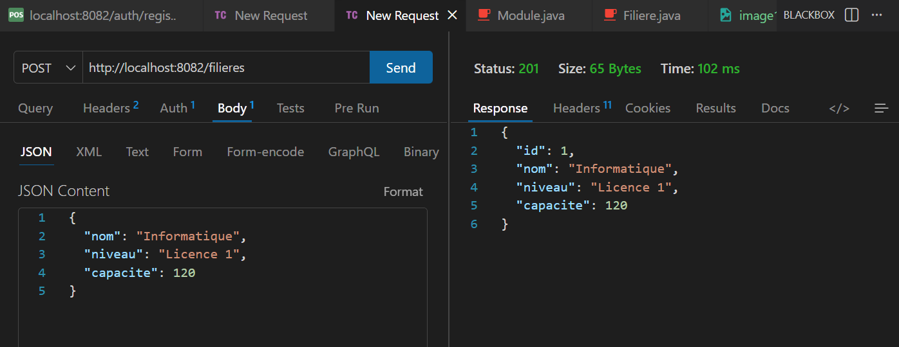
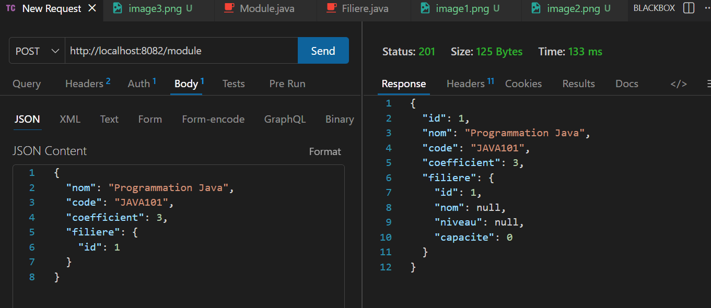
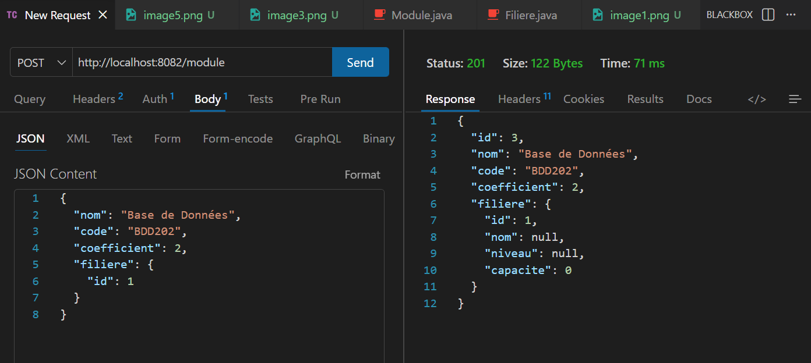
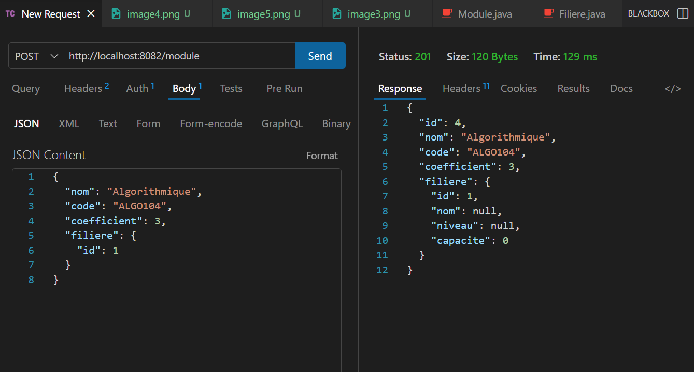
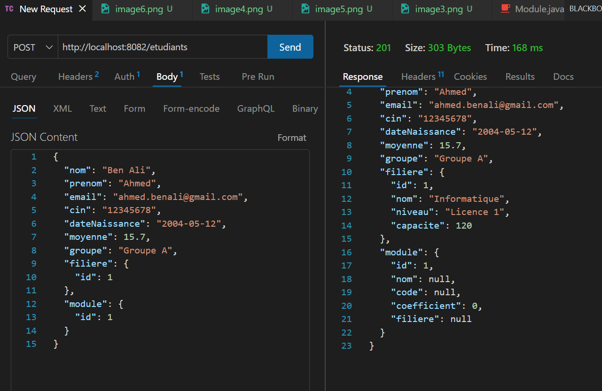
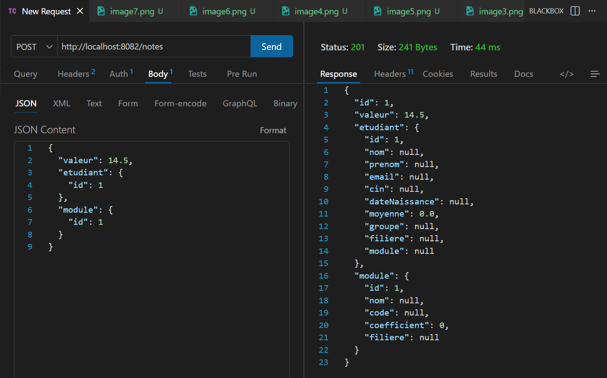
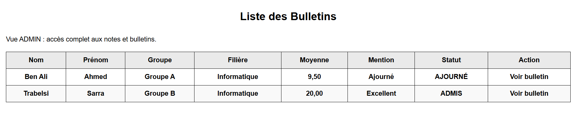
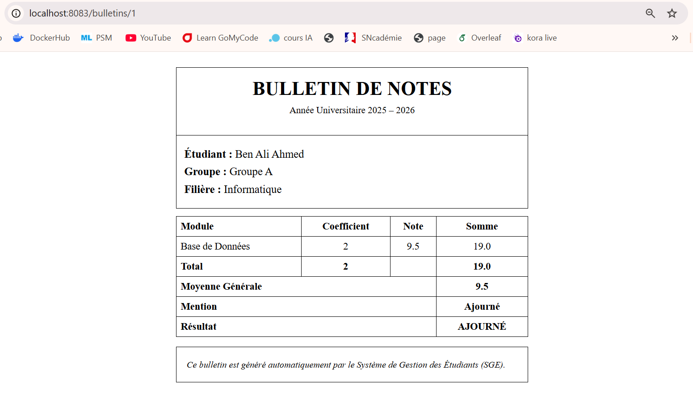

# 📘 Système de Gestion des Étudiants (SGE)

Mini‑projet réalisé dans le cadre des TP de développement avec **Spring Boot** et **Thymeleaf**.  
Il s’agit d’une application  permettant de gérer les étudiants, leurs filières, leurs modules, ainsi que les **notes et bulletins**.

---

##  Fonctionnalités principales
- Gestion des **filières, modules et étudiants** avec persistance en base MySQL.  
- Saisie et calcul automatique des **notes** avec mise à jour de la moyenne.  
- Génération des **bulletins de notes** (moyenne pondérée, mention, statut Admis/Ajourné).  
- Interfaces web avec **Thymeleaf** pour consulter la liste des bulletins et le détail par étudiant.  
- Sécurisation par **JWT** avec rôles **ADMIN** et **USER** (droits différenciés).  
- Tests réalisés via **thunder Client** et intégration d’images de démonstration.  

---

##  Prérequis
- Java 17+  
- Maven  
- MySQL  

---

## Sécurité
Authentification par JWT.

Rôles :

ADMIN : gestion complète (CRUD sur étudiants, filières, modules, notes).

USER : consultation des bulletins et notes.

##  Organisation du projet

- **model/** : entités JPA (`Etudiant`, `Module`, `Note`, `Utilisateur`, `Filiere`)  
- **repository/** : interfaces JPA (`EtudiantRepository`, `ModuleRepository`, `UtilisateurRepository`, `NoteRepository`, etc.)  
- **service/** : logique métier (calcul de la moyenne, attribution de la mention, génération des bulletins)  
- **controller/** : API REST et contrôleurs Thymeleaf (`EtudiantController`, `NoteController`, `BulletinController`, etc.)  
- **dto/** : objets de transfert (`BulletinDTO`, `AuthResponse`, `LoginRequest`, etc.)  
- **security/** : configuration JWT et filtres (`JwtService`, `JwtAuthFilter`, `UserDetailsServiceImpl`, `SecurityConfig`)  
- **templates/** : vues Thymeleaf (`bulletins/liste.html`, `bulletins/detail.html`, `etudiants/liste.html`, etc.)  

## Captures d’écran pour test 

### * post : http://localhost:8082/auth/register

### * post : http://localhost:8082/auth/login

### * post : http://localhost:8082/filieres

### * post : http://localhost:8082/module

### * post : http://localhost:8082/etudiants

 ### * post : http://localhost:8082/notes

 

### * L'Interface http://localhost:8083/bulletins

### * linterface d'un seul etudiant http://localhost:8083/bulletins/1

##  Auteur

- **Nom** : Kawther  
- **class** : DSI2  
- **Projet** : Mini‑projet Spring Boot – Système de Gestion des Étudiants (SGE)  
 
- **Année universitaire** : 2025 – 2026  
